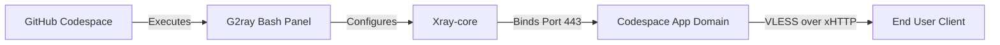

<div align="center">

# G2rayXCodeLeafy

A sleek VLESS proxy manager for GitHub Codespaces.

[](https://github.com/shayanay80atomic/G2rayXCodeLeafy)
[](https://github.com/shayanay80atomic/G2rayXCodeLeafy)
[]()

</div>

---

> **Educational use only:** This project is provided for educational and research purposes. Use it only in ways that comply with applicable laws, GitHub Codespaces policies, network rules, and any services you connect to. You are responsible for your own usage.

---

<div align="center">

<!-- 🎬 Quick Start Tutorial Video -->
https://github.com/user-attachments/assets/79174a4a-ef86-4c1d-9f1a-909d0b29a248

<br>

<!-- 📸 Panel Preview Image -->


</div>

<br>

## Overview

G2ray is a powerful, interactive Bash panel designed to instantly deploy and manage Xray VLESS XHTTP configurations. Built specifically for the GitHub Codespaces environment, it automates port management, traffic monitoring, and connection keep-alives natively.

> **Note:** The panel includes a best-effort anti-sleep engine using Tmux while the Codespace is running. It cannot bypass GitHub quota limits, manual stops, or automatic deletion of stopped Codespaces.

---

<details><summary><kbd>🔗</kbd> Community Donated Configs (SUB)</summary>

Want to use public nodes donated by other G2ray users? Import this raw newline-separated list into clients that support plain VLESS subscriptions:

```text
https://raw.githubusercontent.com/shayanay80atomic/G2rayXCodeLeafy/main/configs.txt
```

</details>

---

### Core Features

#### ⚡ One-Click Deploy & Manage
Generate and start Xray engines in seconds. The beautiful menu-driven CLI interface makes managing nodes and viewing live config links effortless. 

#### 🔄 Smart Auto-Keepalive
Built-in background loops and Tmux keepalives reduce idle shutdowns while the Codespace is active. If GitHub stops, blocks, or deletes the Codespace, reopen it from GitHub Codespaces; the panel will auto-start and self-heal after the container starts again.

#### 📡 Live Analytics & Quota
Tracks real-time RX/TX traffic and resource usage (CPU/RAM). The quota panel is a local 2-core wall-clock estimate that resets by month; GitHub billing remains authoritative. GitHub's 15 GB-month allowance is storage quota, not traffic quota.

#### 📦 Community Config Network
Donate your generated config directly from the CLI to share access with the community. Donation shares the live VLESS link, including its UUID, Codespaces endpoint, and link label, so only donate configs you intentionally want public.

<div align="center">

| 🛠️ Configuration Optimizer |
| :--- |
| To finalize your setup, take the config received from the panel and visit **[NetLeafy](https://code-leafy.github.io/NetLeafy)**. Set the server mode to **G2ray** and paste your link to generate a fully optimized connection. |

</div>

---


## Getting Started

1. **Fork the Repository**  
   → Click **Fork** at the top-right of this page

2. **Choose Your Codespace Region Before Creating It**
   → GitHub profile picture → **Settings** → **Codespaces** → **Region** → choose **Set manually** and pick the region you want. This decides the likely exit IP/country for new configs. You cannot move an existing Codespace to another region; create a new Codespace after changing this setting.

   Common GitHub CLI region names include `WestEurope`, `EastUs`, `WestUs2`, and `SouthEastAsia`. For example:

   ```bash
   gh codespace create -R OWNER/REPO -l WestEurope --idle-timeout 240m
   ```

   After setup, use option `12) Server Location` in the panel to confirm the observed exit IP/country.

3. **Create a Codespace**
   → Open your fork → Click **Code** → **Codespaces** tab → **Create codespace on main**

4. **Wait for Environment**
   → Allow 2-3 minutes for the container to build

5. **Launch Panel**
   → The G2ray CLI panel auto-starts in the terminal!

If browser Codespaces stays on a loading screen for a long time, open the same Codespace in **VS Code Desktop** from the GitHub Codespaces page. The panel runs the same way there and is often faster on slow browser sessions.

<details>
<summary><kbd>⚙️</kbd> Environment Configuration</summary>

While G2ray is designed to be zero-config, advanced users can modify specific variables within the engine script:

- `XRAY_PORT` **(Optional)** — Binds Xray to a custom port. Default: `443`
- `CODESPACE_NAME` **(Optional)** — Overrides auto-detection of the app domain.
- `G2RAY_QR_MODE` **(Optional)** — Controls QR display in the config view: `recommended` (default), `all`, or `none`.
- `G2RAY_EXTRA_FALLBACK_IPS` **(Optional)** — Adds comma-, semicolon-, or space-separated IP fallback candidates before auto-detected ones.
- `G2RAY_DEFAULT_FALLBACK_IPS` **(Optional)** — Replaces the built-in fallback IP candidate list.
- `G2RAY_MAX_FALLBACK_LINKS` **(Optional)** — Caps exported IP fallback links. Default: `3`.
- `G2RAY_EDGE_RECONNECT_THRESHOLD` **(Optional)** — Number of consecutive unreachable edge checks before self-heal may run a full reconnect. Default: `3`.
- `G2RAY_RECONNECT_COOLDOWN_SEC` **(Optional)** — Minimum seconds between automatic full reconnects. Default: `300`.
- `G2RAY_GH_TIMEOUT_SEC` **(Optional)** — Maximum seconds for GitHub CLI control-plane calls. Default: `10`.
- `G2RAY_LOG_MAX_BYTES` **(Optional)** — Maximum bytes per runtime log before rotation. Default: `1048576`.
- `G2RAY_LOG_ROTATE_KEEP` **(Optional)** — Number of rotated log files to keep. Default: `3`.
- `G2RAY_QUOTA_SECONDS` **(Optional)** — Local monthly quota estimate in seconds. Default: `216000` (60 wall-clock hours on a 2-core Codespace).

Generated links include `allowInsecure=1` for compatibility with IP fallback links that still route through the Codespaces SNI/Host. This is a compatibility tradeoff: clients that honor the flag may relax TLS certificate verification.

The panel saves high-resolution QR PNG files under `data/qr/` for the displayed configs. If a phone QR scanner struggles with the terminal QR preview, open the PNG in VS Code/browser, import the copy-ready link from the panel output, or use `configs-to-copy-for-mobile.txt`. Terminal zoom, font rendering, and dark themes can make dense QR codes harder to scan.

</details>

---

## Usage

When launched, the panel provides a 1-to-15 numerical selection menu. Simply type the number corresponding to the action you want to take.

```bash
# If panel did not get shown:
bash ./g2ray.sh
```

### Safer Reproducible Settings

- Set `G2RAY_AUTO_UPDATE=1` only when you want the panel to replace `g2ray.sh` from upstream on startup. It is disabled by default.
- Override the devcontainer build argument `XRAY_VERSION` to change the pinned Xray-core version. Default: `v26.5.9`.

### Codespace Recovery

GitHub can still stop a Codespace for idle timeout, quota, billing, manual stop, rebuild, or retention policy. No process inside the Codespace can restart it after that because all Codespace processes are stopped. To reduce surprise stops, set your GitHub Codespaces **Default idle timeout** to **240 minutes** in GitHub account settings.

To change the idle timeout:

1. Open GitHub in your browser.
2. Click your profile picture in the top-right corner.
3. Open **Settings**.
4. In the left sidebar, open **Codespaces**.
5. Find **Default idle timeout**.
6. Set it to **240 minutes**.
7. Save the setting.

For quick manual recovery from Windows, this repo includes `scripts/reopen-codespace.ps1`:

```powershell
powershell -ExecutionPolicy Bypass -File .\scripts\reopen-codespace.ps1 -Repo OWNER/REPO
```

If GitHub CLI says the `codespace` scope is missing, run:

```powershell
gh auth refresh -h github.com -s codespace
```

The helper uses GitHub's Codespaces start API, waits until the Codespace is available, and opens it in VS Code. If GitHub returns `HTTP 402`, the Codespace is quota or billing blocked and must wait for quota reset or a billing setting change.

### Cloudflare Worker Waker

If you want a phone/browser/curl-accessible manual wake button, this repo includes a Cloudflare Worker template in `worker/codespace-waker/`. It exposes a private `/wake` endpoint that calls GitHub's Codespaces start API. The Worker stores the GitHub token and wake secret as Cloudflare secrets, not in git.

The Worker also provides a private **Health dashboard** for mobile use. It shows GitHub state, XHTTP route readiness, route latency, idle timeout, last-used time, last failure, copyable status text, and optional KV-backed history. This is external health only; it does not expose your UUID, VLESS links, or the panel's full option `14) Diagnostics` output.

The panel can guide this from **Option 15: Recovery / Waker Setup**. It detects the current Codespace name, generates a wake secret, reminds you to set Default idle timeout to 240 minutes, and saves only non-sensitive metadata such as the Worker URL and wake-secret fingerprint.

After the Worker starts the Codespace, it briefly probes the `app.github.dev` XHTTP route. If the response says `route_ready: true`, your existing VLESS configs should work again. If it says `route_ready: false` with HTTP `404`, GitHub has started the Codespace but the port route is still settling; wait 1-2 minutes and retry, or open the panel and use option `6) Force Reconnect`.

Do not paste the GitHub token into G2ray. Create the token in GitHub, save it privately, and enter it directly in Cloudflare as the `GITHUB_TOKEN` secret. The wake secret is shown once by the panel; save it privately and enter it directly in Cloudflare as the `WAKE_SECRET` secret.

Classic token path:

1. Open <https://github.com/settings/tokens/new?scopes=codespace>.
2. Give it a clear name, such as `G2ray Codespace Waker`.
3. Choose an expiration you can remember.
4. Keep only the `codespace` scope selected.
5. Generate the token and copy it once.

Cloudflare dashboard binding types:

- `CODESPACE_NAME`: **Plaintext** variable.
- `CODESPACE_PORT`: **Plaintext** variable only if you changed `XRAY_PORT`; omit it for the default `443`.
- `GITHUB_TOKEN`: **Secret** variable.
- `WAKE_SECRET`: **Secret** variable.

Optional Cloudflare dashboard bindings:

- `WAKER_KV`: KV namespace binding for dashboard history.
- `DISCORD_WEBHOOK_URL`: **Secret** variable for Discord alerts.
- `TELEGRAM_BOT_TOKEN`: **Secret** variable for Telegram alerts.
- `TELEGRAM_CHAT_ID`: **Secret** variable for Telegram alerts.

The Worker URL can be entered with or without `https://`, and with or without `/wake`; the panel normalizes it to `https://YOUR_WORKER.workers.dev/wake`.

Quick setup:

```bash
cd worker/codespace-waker
cp wrangler.toml.example wrangler.toml
# edit wrangler.toml and set CODESPACE_NAME
npx wrangler secret put GITHUB_TOKEN
npx wrangler secret put WAKE_SECRET
npx wrangler deploy
```

Wake call:

```bash
read -rsp "Wake secret: " WAKE_SECRET; echo
curl -X POST -H "Authorization: Bearer ${WAKE_SECRET}" https://YOUR_WORKER.workers.dev/wake
unset WAKE_SECRET
```

The browser form is preferred because it keeps the wake secret out of shell history. See `worker/codespace-waker/README.md` for the full setup and token guidance.

---

## Architecture



<details>
<summary><kbd>📁</kbd> Project Structure</summary>

```text
G2rayXCodeLeafy/
├── data/                    # Dynamic storage for usage stats, UUIDs, & config
├── logs/                    # Xray engine error logs
├── assets/                  # Media resources (previews & videos)
├── configs.txt              # Community donated subscription configs
└── g2ray.sh                 # The main interactive panel script
```

</details>

---

<details>
<summary><kbd>❓</kbd> FAQ & Troubleshooting</summary>

**My Codespace keeps shutting down?**
Ensure you have activated Option `7` in the G2ray panel (Toggle Anti-Sleep Mode) to spawn a background Tmux session that simulates activity while the Codespace is running. This is best-effort: GitHub may still stop the Codespace when quota, budget, idle-timeout policy, or retention/deletion rules apply.

**Will it restart after my monthly quota resets?**
Not by itself while GitHub is blocking or stopping the Codespace, because no code runs inside a stopped Codespace. After the monthly included usage resets, reopen the Codespace from GitHub; `postStartCommand` runs `g2ray.sh --silent-start`, starts Xray, starts the supervisor, and refreshes exported configs.

**Is the 15 GB limit my VPN data limit?**
No. GitHub's 15 GB-month included allowance is Codespaces storage. The panel's RX/TX traffic counter measures tunnel traffic for your visibility, but it is not the same as the GitHub storage quota.

**Why are my speeds slow?**
Codespace region affects the likely exit IP/country and latency. Set the desired region before creating the Codespace, then confirm the real observed exit IP with option `12) Server Location`. GitHub/Azure region labels are not a perfect country guarantee, and changing the setting later does not move an existing Codespace.

</details>

<br>

<div align="center">

> **Educational Purpose Only:** This project is provided for educational and research purposes. Users are solely responsible for compliance with applicable laws, platform policies, and network rules. The maintainers assume no liability for misuse.

[MIT License](https://github.com/shayanay80atomic/G2rayXCodeLeafy/blob/main/LICENSE) · Based on the Code-Leafy project
</div>
