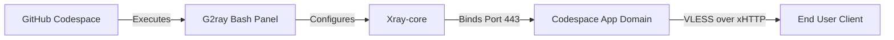

<div align="center">

# G2rayXCodeLeafy

A sleek VLESS proxy manager for GitHub Codespaces.

[](#g2rayxcodeleafy)
[](LICENSE)
[]()

</div>

---

> **Personal test and educational use only:** This project is provided for private testing, education, and research. Do not publish generated configs, run a public access service, or use it in ways that violate applicable laws, GitHub Codespaces policies, network rules, or any services you connect to. You are responsible for your own usage.

---

<div align="center">

<!-- 🎬 Quick Start Tutorial Video -->
https://github.com/user-attachments/assets/79174a4a-ef86-4c1d-9f1a-909d0b29a248

<br>

<!-- 📸 Panel Preview Image -->


</div>

<br>

## Overview

G2ray is a powerful, interactive Bash panel designed to instantly deploy and manage Xray VLESS XHTTP configurations. Built specifically for the GitHub Codespaces environment, it automates port management, traffic monitoring, and connection keep-alives natively.

> **Note:** The panel includes a best-effort anti-sleep engine using Tmux while the Codespace is running. It cannot bypass GitHub quota limits, manual stops, or automatic deletion of stopped Codespaces.

---

### Core Features

#### ⚡ One-Click Deploy & Manage
Generate and start Xray engines in seconds. The beautiful menu-driven CLI interface makes managing nodes and viewing live config links effortless. 

#### 🔄 Smart Auto-Keepalive
Built-in background loops and Tmux keepalives reduce idle shutdowns while the Codespace is active. If GitHub stops, blocks, or deletes the Codespace, reopen it from GitHub Codespaces; the panel will auto-start and self-heal after the container starts again.

#### 📡 Live Analytics & Quota
Tracks real-time RX/TX traffic and resource usage (CPU/RAM). The quota panel is a local 2-core wall-clock estimate that resets by month; GitHub billing remains authoritative. GitHub's 15 GB-month allowance is storage quota, not traffic quota.

#### 📦 Private Local Exports
The panel writes copy-ready configs and a base64 subscription file inside your Codespace only. These generated files are ignored by git because they contain live connection credentials. Use them for your own devices and private tests; do not commit, publish, or share them as a public subscription.

<div align="center">

| Private Client Import |
| :--- |
| Import the copy-ready links or the local base64 subscription file directly into your own test client. Pasting a VLESS link into any third-party tool shares live access details for that node; use only tools you trust, and rotate/regenerate afterward if you need to revoke access. |

</div>

---


## Getting Started

1. **Fork the Repository**  
   → Click **Fork** at the top-right of this page

2. **Choose Your Codespace Region Before Creating It**
   → GitHub profile picture → **Settings** → **Codespaces** → **Region** → choose **Set manually** and pick the region you want. This decides the likely exit IP/country for new configs. You cannot move an existing Codespace to another region; create a new Codespace after changing this setting.

   Common GitHub CLI region names include `WestEurope`, `EastUs`, `WestUs2`, and `SouthEastAsia`. For example:

   ```bash
   gh codespace create -R OWNER/REPO -l WestEurope --idle-timeout 240m
   ```

   After setup, use option `12) Server Location` in the panel to confirm the observed exit IP/country.

3. **Create a Codespace**
   → Open your fork → Click **Code** → **Codespaces** tab → **Create codespace on main**

4. **Wait for Environment**
   → Allow 2-3 minutes for the container to build

5. **Launch Panel**
   → The G2ray CLI panel auto-starts in the terminal. On a fresh Codespace, choose `1) Generate Config & Start`; after config generation, the panel can guide Worker setup, show a recovery card, and open diagnostics.

If browser Codespaces stays on a loading screen for a long time, open the same Codespace in **VS Code Desktop** from the GitHub Codespaces page. The panel runs the same way there and is often faster on slow browser sessions.

### Remote Control From Another Computer

This devcontainer includes the official `sshd` feature so authenticated GitHub CLI sessions can control the Codespace remotely. After pulling a version with this feature, rebuild the Codespace once from GitHub or with:

```bash
gh codespace rebuild -c <CODESPACE_NAME> --full
```

Then connect from another computer:

```bash
gh auth login
gh auth refresh -h github.com -s codespace
gh codespace ssh -c <CODESPACE_NAME>
```

Run one-off checks without opening the panel:

```bash
gh codespace ssh -c <CODESPACE_NAME> -- \
  'bash -lc '\''cd "$(find /workspaces -maxdepth 2 -name g2ray.sh -printf "%h\n" | head -n1)" && bash ./g2ray.sh --doctor-json'\'''
```

If your network blocks direct Codespaces access, run the GitHub CLI through your local SOCKS proxy before calling `gh`.
For `gh codespace ssh` and `gh codespace rebuild`, use `socks5://` rather than `socks5h://`; the GitHub Codespaces tunnel RPC can fail if DNS is delegated to the SOCKS proxy.

```bash
export HTTPS_PROXY=socks5://127.0.0.1:10808
export HTTP_PROXY=socks5://127.0.0.1:10808
export ALL_PROXY=socks5://127.0.0.1:10808
```

PowerShell:

```powershell
$env:HTTPS_PROXY = "socks5://127.0.0.1:10808"
$env:HTTP_PROXY = "socks5://127.0.0.1:10808"
$env:ALL_PROXY = "socks5://127.0.0.1:10808"
```

`gh codespace ssh` is GitHub-authenticated remote access, not a public SSH server. Do not forward SSH publicly.

<details>
<summary><kbd>⚙️</kbd> Environment Configuration</summary>

While G2ray is designed to be zero-config, advanced users can modify specific variables within the engine script:

- `XRAY_PORT` **(Optional)** — Binds Xray to a custom port. Default: `443`
- `CODESPACE_NAME` **(Optional)** — Overrides auto-detection of the app domain.
- `G2RAY_QR_MODE` **(Optional)** — Controls QR display in the config view: `recommended` (default), `all`, or `none`.
- `G2RAY_EXTRA_FALLBACK_IPS` **(Optional)** — Adds comma-, semicolon-, or space-separated IP fallback candidates before auto-detected ones.
- `G2RAY_DEFAULT_FALLBACK_IPS` **(Optional)** — Replaces the built-in fallback IP candidate list.
- `G2RAY_MAX_FALLBACK_LINKS` **(Optional)** — Caps exported usable IP fallback links. Default: `30`.
- `G2RAY_ROUTE_MONITOR_MAX_CANDIDATES` **(Optional)** — Caps cached candidate route probes shown in diagnostics. Default: `40`, hard-capped at `64`.
- `G2RAY_DIAGNOSTIC_MAX_FALLBACK_PROBES` **(Optional)** — Caps live fallback route probes in option `14) Diagnostics`. Default: `12`.
- `G2RAY_ROUTE_HEALTH_TTL_SEC` **(Optional)** — Seconds cached route health can be reused to order exported configs before refreshing. Default: `300`.
- `G2RAY_DNS_CACHE_TTL_SEC` **(Optional)** — Seconds DNS/provider-discovered route IP candidates stay cached before provider lookups run again. Default: `300`; set `0` to disable this DNS candidate cache.
- `G2RAY_WIDE_DNS_DISCOVERY` **(Optional)** — Enables a bounded wider DNS sweep for the Codespaces hostname before route probing. Default: `1`. It asks Google DNS for several EDNS client-subnet views, then keeps only unique IPs that pass the normal HTTP route probe.
- `G2RAY_WIDE_DNS_ECS_SUBNETS` / `G2RAY_WIDE_DNS_MAX_ECS_SUBNETS` **(Optional)** — Tune the EDNS client-subnet hints used by wide DNS discovery. Defaults are a small curated resolver-region list and a cap of `12` hints, hard-capped at `24`. This is DNS discovery, not an Azure IP-range scanner.
- `G2RAY_ROUTE_PROBE_CONCURRENCY` **(Optional)** — Maximum parallel route candidate probes during a route-health refresh. Default: `6`, hard-capped at `16`.
- `G2RAY_ROUTE_FAILURE_COOLDOWN_SEC` **(Optional)** — Seconds to temporarily skip candidates that timed out or returned edge/origin errors. Default: `180`.
- `G2RAY_EXPORT_REVALIDATE_TOP_CACHED=0` **(Optional, legacy name)** — Disable the default revalidation of cached route IPs before exporting configs. Leave enabled so stale cached IPs are skipped/replaced during export; disable only when you need fastest possible export generation and accept that older cached IPs may be printed.
- `G2RAY_ALLOW_STALE_FALLBACK_EXPORT=1` **(Emergency, optional)** — Allows cached route IPs to be exported when every live fallback probe fails. Default: disabled, so all-live-probe failure exports the domain link only instead of printing stale IP configs that may be dead from the client side.
- `G2RAY_LAST_GOOD_ROUTE_MAX_AGE_SEC` **(Optional)** — Seconds a last-good route can break ties in exported config ordering. Default: `1800`; set `0` to disable last-good tie preference.
- `G2RAY_XHTTP_EXTRA_JSON` **(Optional)** — Exported links omit the XHTTP `extra` parameter by default for broad client compatibility. Supply a complete valid JSON object only for a client you have tested, e.g. `{"xmux":{"hMaxRequestTimes":600},"scMaxEachPostBytes":1000000}`. Regenerate and re-import after changing it.
- WebSocket fallback is controlled from panel option `19) Toggle WebSocket Fallback`; once enabled or disabled, the preference is saved under `data/` and survives future panel sessions until you toggle it again. It adds a separate WebSocket VLESS inbound and appends WS fallback links after the normal XHTTP configs. Each WS route is exported as three compatibility variants: forced `h2`, forced `http/1.1`, and blank/no ALPN. XHTTP remains the recommended default because it is the cleaner primary transport for this project; WS is only a compatibility escape hatch for clients or networks where XHTTP behaves badly.
- `G2RAY_WS_PORT` / `G2RAY_WS_PATH` / `G2RAY_WS_MAX_FALLBACK_LINKS` **(Advanced, optional)** — Tune the WS fallback after enabling it from the panel. Defaults are port `8443`, path `/ws`, and up to `3` IP fallback links plus the WS domain link. If you use a Worker, add `CODESPACE_PORT` only for the primary XHTTP port; the panel itself reasserts the optional WS Codespaces port when the Codespace is running.
- `G2RAY_TCP_KEEPALIVE_INTERVAL` / `G2RAY_TCP_KEEPALIVE_IDLE` **(Optional)** — Seconds for TCP keepalive on the inbound and direct-outbound sockets (defaults `15` / `30`). Keepalive keeps idle connections warm and lets the kernel detect and reset dead/half-open sockets promptly, instead of leaving stale connections that a client reuses and stalls on (the cause of "page stops loading until I reopen the app"). These run datacenter-to-datacenter, so they do not affect a mobile client's battery.
- `G2RAY_TCP_FAST_OPEN` **(Optional)** — Controls TCP Fast Open on the freedom (direct) outbound, which can save a round-trip when the Codespace opens connections to destination sites. `auto` (default) enables it only when the kernel advertises client TFO support (`net.ipv4.tcp_fastopen` bit `0x1`), so it never risks outbound dialing on a kernel that lacks it; `1` forces it on, `0` forces it off. Applies to a newly generated config; regenerate (option `2`) after changing it.
- `G2RAY_PERFORMANCE_PROFILE` **(Optional)** — Config profile used when generating a new Xray config: `balanced` (default), `low_latency`, `streaming`, `unstable_mobile`, `low_overhead`, or `max_throughput`. `max_throughput` spends the Codespace's spare CPU/RAM on bigger XHTTP upload chunks, more concurrent upload streams, and larger per-connection buffers for higher download/upload speed on high-latency paths (it does not lower ping). The selected profile persists in `data/performance_profile.txt`; the env var still overrides it. Prefer the `profile` subcommand below, which applies the change without changing your UUID.
- `G2RAY_LOW_OVERHEAD=1` **(Optional)** — Starts the panel in low-overhead mode, which applies the `low_overhead` profile, reduces INFO logs, and reduces less-essential background route/export refreshes. You can also toggle this from option `18`. It can improve steadiness on constrained Codespaces, but it may reduce peak throughput.
- `G2RAY_LATENCY_FOCUS=1` **(Optional)** — Starts the panel in latency-focus mode, which applies the `low_latency` profile, keeps heartbeat/self-heal active, and minimizes noncritical background route/export refreshes. You can also toggle this from option `49`. It aims to reduce queueing and idle stalls; it cannot remove ISP packet loss by itself.
- `G2RAY_PORT_PUBLIC_TTL_SEC` **(Optional)** — Seconds to trust the last successful `gh codespace ports visibility 443:public` call before calling GitHub again. Default: `300`.
- `G2RAY_WAKER_TEST_TIMEOUT_SEC` **(Optional)** — Seconds the panel waits when testing the Cloudflare Worker from option `15) Recovery / Waker Setup`. Default: `180`.
- `G2RAY_EDGE_RECONNECT_THRESHOLD` **(Optional)** — Number of consecutive unreachable edge checks before self-heal may run a full reconnect. Default: `3`.
- `G2RAY_RECONNECT_COOLDOWN_SEC` **(Optional)** — Minimum seconds between automatic full reconnects. Default: `300`.
- `G2RAY_ROUTE_WAIT_SEC` **(Optional)** — Maximum seconds startup waits for the `app.github.dev` XHTTP route after a Codespace resume. Default: `120`.
- `G2RAY_FORCE_RECONNECT_ROUTE_WAIT_SEC` **(Optional)** — Maximum seconds the repair step waits for the `app.github.dev` route after toggling port visibility. Default: `60`.
- `G2RAY_GH_TIMEOUT_SEC` **(Optional)** — Maximum seconds for GitHub CLI control-plane calls. Default: `10`.
- `G2RAY_LOG_MAX_BYTES` **(Optional)** — Maximum bytes per runtime log before rotation. Default: `1048576`.
- `G2RAY_LOG_ROTATE_KEEP` **(Optional)** — Number of rotated log files to keep. Default: `3`.
- `G2RAY_SUPPORT_INCLUDE_NETWORK=1` **(Optional)** — Include full Codespace/domain/IP route metadata in support bundles. Default support bundles redact those network identifiers so they are safer to share.
- `G2RAY_QUOTA_SECONDS` **(Optional)** — Local monthly quota estimate in seconds. Default: `216000` (60 wall-clock hours on a 2-core Codespace).

Generated links use `insecure=0&allowInsecure=0` by default so clients keep TLS certificate verification enabled. If a specific client cannot handle IP fallback links with SNI/Host routing, `allowInsecure=1` can be tried manually as a compatibility workaround, but that relaxes certificate verification and is not the default.

By default the panel can export up to 30 usable IP fallback configs plus the domain config, ordered by rolling route health: pinned preference, failure penalty, recent weighted XHTTP latency, latest XHTTP latency, and temporary cooldowns for candidates that timed out or returned edge/origin errors. These numbers are strict-TLS `OPTIONS` probes against the Codespaces XHTTP route from the Codespace/panel side, not ICMP ping, full throughput tests, or proof that your ISP/client path can reach every edge IP. If GitHub/DNS exposes fewer healthy unique edge routes, the panel exports fewer rather than duplicating weak or unusable routes; if your client network blocks a specific IP, blacklist it in option `17) Route Candidates` or let the Android client's real-delay tests rank it below working configs. Option `17` also has batch manual IPv4 import for messy copied candidate lists; imported IPs are still probed before they become recommended configs.

Longer sessions help the panel learn route health, but they do not make one fixed internet path magically faster. After 30 minutes, the useful gains are: stale or flaky edge IPs get penalized, recent latency averages become more meaningful, the top cached route is revalidated before export, TCP keepalive clears dead idle sockets faster, and you can pin a route that your own client proves is best. For the lowest real latency, test the first few exported IP links from the actual client/network, then pin the winner in option `17) Route Candidates`.

If your own network blocks the app.github.dev domain but measured IP fallback links work, set `G2RAY_EXPORT_DOMAIN_LINK=0` or write `0` to `data/export_domain_link.txt` before refreshing exports. The default keeps the domain link because it remains useful on networks where app.github.dev is allowed.

The panel saves high-resolution QR PNG files under `data/qr/` for the displayed configs. If a phone QR scanner struggles with the terminal QR preview, open the PNG in VS Code/browser, import the copy-ready link from the panel output, or use `configs-to-copy-for-mobile.txt`. Terminal zoom, font rendering, and dark themes can make dense QR codes harder to scan.

</details>

---

## Usage

When launched, the panel provides a 1-to-17 numerical selection menu. Simply type the number corresponding to the action you want to take.

```bash
# If panel did not get shown:
bash ./g2ray.sh
```

### Safer Reproducible Settings

- Set `G2RAY_AUTO_UPDATE=1` only when you want the panel to replace `g2ray.sh` from upstream on startup. It is disabled by default.
- Override the devcontainer build argument `XRAY_VERSION` to change the pinned Xray-core version. Default: `v26.5.9`.

### Codespace Recovery

GitHub can still stop a Codespace for idle timeout, quota, billing, manual stop, rebuild, or retention policy. No process inside the Codespace can restart it after that because all Codespace processes are stopped. To reduce surprise stops, set your GitHub Codespaces **Default idle timeout** to **240 minutes** in GitHub account settings.

Before you get close to monthly quota exhaustion, also mark the Codespace as **Keep codespace** from the GitHub Codespaces page when that option is available. GitHub quota exhaustion does not immediately mean deletion, but stopped Codespaces can still be removed by retention policy. For org-owned or policy-managed Codespaces, the Keep option may be unavailable or overridden by organization retention rules; export or push anything important before quota exhaustion. The same VLESS configs survive into the next monthly reset only if the same Codespace name/domain survives.

To change the idle timeout:

1. Open GitHub in your browser.
2. Click your profile picture in the top-right corner.
3. Open **Settings**.
4. In the left sidebar, open **Codespaces**.
5. Find **Default idle timeout**.
6. Set it to **240 minutes**.
7. Save the setting.

For quick manual recovery from Windows, this repo includes `scripts/reopen-codespace.ps1`:

```powershell
powershell -ExecutionPolicy Bypass -File .\scripts\reopen-codespace.ps1 -Repo OWNER/REPO
```

If GitHub CLI says the `codespace` scope is missing, run:

```powershell
gh auth refresh -h github.com -s codespace
```

The helper uses GitHub's Codespaces start API, waits until the Codespace is available, and opens it in VS Code. If GitHub returns `HTTP 402`, the Codespace is quota or billing blocked and must wait for quota reset or a billing setting change.

Linux recovery after Worker wake:

```bash
CS="YOUR_CODESPACE_NAME"
REPO="OWNER/REPO"
APP="https://${CS}-443.app.github.dev/"

gh auth refresh -h github.com -s codespace
gh codespace view -c "$CS" --json name,state,lastUsedAt,idleTimeoutMinutes --jq '{name,state,lastUsedAt,idleTimeoutMinutes}'
gh codespace ports -c "$CS"
gh codespace ports visibility 443:public -c "$CS"
curl -sS -o /dev/null -w "route=%{http_code} time=%{time_total}s\n" -X OPTIONS "$APP"
```

If the route prints `000` or DNS errors after GitHub says the Codespace is active, open the Codespace once and run panel option `14) Diagnostics`. If XHTTP is `404` or unusable, use option `6) Recover Now`. Recover Now first tries a soft, idempotent repair: verify/start Xray, reassert port visibility, wait for the route, repair visibility once, refresh route candidates, and refresh exported configs. It offers a hard restart only if the route still looks stuck.

Headless recovery/status commands:

```bash
bash ./g2ray.sh --recover-now
bash ./g2ray.sh --recover-now --json
bash ./g2ray.sh --doctor-json
bash ./g2ray.sh status
bash ./g2ray.sh start
bash ./g2ray.sh export
bash ./g2ray.sh --support-bundle
bash ./g2ray.sh latency-focus on
bash ./g2ray.sh profile max_throughput
bash ./g2ray.sh bench --json --mock
```

`profile <name>` saves the performance profile to `data/performance_profile.txt` and, if a config already exists, re-applies it to the running config **keeping the same UUID**, so you do not have to re-import client links. Run `profile` (or `profile status`) with no name to print the effective profile, saved base profile, active panel modes, and available names. This is the reliable way to switch profiles in a Codespace, because it does not depend on exporting `G2RAY_PERFORMANCE_PROFILE` in the same shell the panel happens to launch from.

`bench` now runs in an isolated throwaway runtime directory by default; pass `bench --live` only if you intentionally want the budget checks to run against your real `data/`/`logs/` (which reasserts port visibility and rewrites exports). `bench --json --mock` remains the explicit isolated form CI uses.

`--recover-now` is non-interactive and soft-only: it verifies/starts Xray, reasserts public port visibility, waits for route readiness, refreshes route candidates, and refreshes exported configs. If the route is still settling, it can exit nonzero; open the interactive panel and use option `6) Recover Now` if you want the hard restart prompt.

`--recover-now --json` runs the same soft recovery path but prints a machine-readable result with `status`, `route_ready`, `edge_probe`, and `next_action` fields. It is for automation already running inside the Codespace after the Codespace has been started or attached. External VPS automation cannot run this command inside a stopped Codespace; use the Cloudflare Worker wake endpoint or GitHub Codespaces API first, then use this command from inside the Codespace if local route recovery is still needed.

`bench --json --mock` runs isolated mocked performance budget checks for the panel hot paths: cached XHTTP config parsing, route ordering, export generation, doctor JSON, and recover JSON. It does not probe the live network and it writes only to a temporary runtime directory, so CI can use it as a deterministic regression guard without touching your real `data/` or `logs/` state.

`--support-bundle` creates a redacted `.tar.gz` support bundle under `logs/`. It includes doctor JSON, diagnostics, structured event logs, route health, rolling route stats, route-settling history, and Xray logs while redacting VLESS links, UUIDs, bearer tokens, GitHub tokens, and wake secrets.

`export` refreshes local helper files in the Codespace: `configs-to-copy-for-mobile.txt`, `configs-subscription-base64.txt`, and `configs-meta.json`. These files are for your own devices and private tests only. The base64 subscription is encoding, not encryption, and generated exports are git-ignored because they contain live credentials.

Local verification commands:

```bash
bash -n ./g2ray.sh
bash -n ./scripts/post-start.sh
bash -n ./tests/g2ray_static_tests.sh
bash -n ./tests/g2ray_behavior_tests.sh
bash ./tests/g2ray_static_tests.sh
bash ./tests/g2ray_behavior_tests.sh
bash ./g2ray.sh bench --json --mock
cd worker/codespace-waker
npm ci
npm run check
npm test
```

After `git pull`, reattach the panel or run:

```bash
bash ./g2ray.sh --silent-start
bash ./scripts/post-start.sh
```

`--silent-start` starts or replaces the background supervisor with the pulled script version, verifies runtime readiness, records `data/boot_status.json`, and refreshes exports without stopping a healthy Xray process. `scripts/post-start.sh` is what the devcontainer runs automatically; it wraps `--silent-start` and writes `logs/post-start.log` so a start from the Worker is easier to diagnose later.

Persistent logs are written to `logs/g2ray.log`, `logs/g2ray-events.jsonl`, and `logs/g2ray-diagnostics.log`. Diagnostics records a readable snapshot there, so you can send those logs later and still preserve route waits, repairs, probe results, supervisor state, last-good route, route-settling history, and export refreshes from previous hours.

Option `16) Live Monitor` is a foreground status screen for intentional terminal monitoring. It refreshes engine state, local/edge XHTTP probes, supervisor heartbeat, self-heal counters, route-settling history, best route candidates, and recent events without restarting Xray.

Option `17) Route Candidates` opens the Route Candidates manager. It shows measured route IPs with last latency, average latency, recent weighted latency, success ratio, source, and failure reason; lets you add a manual IPv4 candidate, pin a preferred route, blacklist a bad route, unblacklist/remove entries, reset measured route health without wiping preferences, explicitly reset all route preferences, and refresh exports. Use this only for specific edge IPs you have measured; it does not scan broad Azure/GitHub ranges.

Option `19) Toggle WebSocket Fallback` enables or disables the advanced WS fallback from inside the panel and saves that preference under `data/`. When a config already exists, the panel reapplies the transport change with the same UUID so existing clients are not invalidated just because fallback mode changed. After enabling it, make sure Codespaces shows the optional WS port public, then import the WS links printed after the XHTTP links. Each WS route is printed three ways: `h2` for HTTP/2-capable paths, `h1.1` for classic WebSocket Upgrade compatibility, and blank ALPN for clients or networks that behave better without forcing ALPN. Use WS only as a fallback comparison; if XHTTP works well, keep using the XHTTP links first.

Option `20) Cloudflare WS Front` stores a Cloudflare-proxied front hostname such as `ws.example.com` and prints the exact Codespaces WS origin hostname it must target. When WS fallback is enabled and a front hostname is saved, the config screen adds `Cloudflare WebSocket front link` variants before the direct WS fallback links. Configure Cloudflare DNS as a proxied CNAME to the `-8443.app.github.dev` origin, then add an Origin Rule for that hostname that overrides the origin Host header/SNI to the same Codespaces `-8443.app.github.dev` hostname. If your Cloudflare plan cannot set Host/SNI override rules, a simple proxied CNAME is not expected to be reliable because Codespaces routing still needs the original `app.github.dev` host identity at the origin.

Option `18) Toggle Low-Overhead Mode` applies the `low_overhead` profile, reduces INFO-level app logging, and slows less-essential background route/export refreshes while keeping heartbeat and self-heal checks alive. It is mutually exclusive with latency focus mode. Use it when configs already work and you want steadier low-resource behavior; turn it off when collecting diagnostics or chasing peak throughput.

Option `49) Toggle Latency Focus Mode` applies the `low_latency` profile, keeps heartbeat/session accounting/self-heal alive, suppresses non-error app logs, and skips noncritical background route/export/message refreshes while the mode is active. It is mutually exclusive with low-overhead mode. Use it while measuring client latency or testing browser idle-stall behavior; turn it off before collecting support logs or expecting automatic export updates.

The config screen writes three local export helpers: `configs-to-copy-for-mobile.txt`, `configs-subscription-base64.txt`, and `configs-meta.json`. They are ignored by git by default because they include live connection credentials or metadata. Use them locally inside the Codespace, or copy them only through a private channel you control. This project intentionally does not publish a raw GitHub subscription URL.

Codespaces port `443` is made publicly reachable so your private client config can reach the XHTTP listener through GitHub's app route. Treat every generated VLESS link and local subscription file as a bearer credential: keep them private, regenerate the config if they leak, and do not operate a public/shared access service.

On first setup, the panel shows a small recovery card so you can copy these recovery commands safely: `bash ./g2ray.sh --doctor-json`, `bash ./g2ray.sh --recover-now`, `bash ./g2ray.sh --recover-now --json`, `bash ./g2ray.sh --support-bundle`, and, when a Worker is configured, a curl template using `Authorization: Bearer <WAKE_SECRET>`. The raw wake secret is never printed from saved metadata.

### Cloudflare Worker Waker

If you want a phone/browser/curl-accessible manual wake button, this repo includes a Cloudflare Worker template in `worker/codespace-waker/`. The `GET /wake` page is public so it can load in your browser, but `POST /wake` and the `/api/*` actions are protected by your wake secret. The Worker stores the GitHub token and wake secret as Cloudflare secrets, not in git.

The Worker also provides a **Health dashboard** page for mobile use. The page itself can load in a browser, but wake, health, history, and copyable status actions require your wake secret. It shows GitHub state, XHTTP route readiness, route latency, idle timeout, last-used time, last failure, quota survival state, retention/deletion risk, copyable status text, route history summary, latency trend, and optional KV-backed history. This is external health only; it does not expose your UUID, VLESS links, or the panel's full option `14) Diagnostics` output.

The panel can guide this from **Option 15: Recovery / Waker Setup**. It detects the current Codespace name, generates a wake secret, reminds you to set Default idle timeout to 240 minutes, and saves only non-sensitive metadata such as the Worker URL and wake-secret fingerprint.

After the Worker starts the Codespace, it briefly probes the `app.github.dev` XHTTP route. If the response says `route_ready: true`, your existing VLESS configs should work again. If it says `route_ready: false` with HTTP `404`, GitHub has started the Codespace but the port route is still settling; wait 1-2 minutes and retry, or open the panel and use option `6) Recover Now`.

Do not paste the GitHub token into G2ray. Create the token in GitHub, save it privately, and enter it directly in Cloudflare as the `GITHUB_TOKEN` secret. The wake secret is shown once by the panel; save it privately and enter it directly in Cloudflare as the `WAKE_SECRET` secret.

Classic token path:

1. Open <https://github.com/settings/tokens/new?scopes=codespace>.
2. Give it a clear name, such as `G2ray Codespace Waker`.
3. Choose an expiration you can remember.
4. Keep only the `codespace` scope selected.
5. Generate the token and copy it once.

Cloudflare dashboard binding types:

- `CODESPACE_NAME`: **Plaintext** variable.
- `CODESPACE_PORT`: **Plaintext** variable only if you changed `XRAY_PORT`; omit it for the default `443`.
- `GITHUB_TOKEN`: **Secret** variable.
- `WAKE_SECRET`: **Secret** variable.

Optional Cloudflare dashboard bindings:

- `WAKER_KV`: KV namespace binding for dashboard history. Recommended for public deployments because it also enables failed wake-secret lockout and optional successful-wake cooldown; without KV, use a long random wake secret and rotate it if exposed.
- `QUOTA_SURVIVAL_CRON_ENABLED`: **Plaintext** variable set to `true` only if you also configure a Cloudflare Cron Trigger and want conservative quota-reset checks.
- `DISCORD_WEBHOOK_URL`: **Secret** variable for Discord alerts.
- `TELEGRAM_BOT_TOKEN`: **Secret** variable for Telegram alerts.
- `TELEGRAM_CHAT_ID`: **Secret** variable for Telegram alerts.
- `WAKE_COOLDOWN_SECONDS`: **Plaintext** optional seconds to prevent repeated successful wake requests from spamming GitHub when KV is configured. Leave unset for no successful-wake cooldown. Any nonzero value below `60` is treated as `60` because Cloudflare KV expiration TTLs require at least 60 seconds.
- `WAKE_FAST_PATH`: **Plaintext** optional toggle for the Worker's warm-route fast path. Default: `1`. When enabled, `/wake` first does a cheap route probe and, if the Codespace route is already stable and GitHub says it is Available, skips the GitHub `/start` call.
- `CODESPACE_FORWARDING_DOMAIN`: **Plaintext** optional override for Codespaces route hostnames if GitHub changes the forwarding domain from `app.github.dev`. The Worker also accepts `CODESPACE_PORT_FORWARDING_DOMAIN` and `GITHUB_CODESPACES_PORT_FORWARDING_DOMAIN`.
- `ROUTE_POLL_AFTER_SECONDS`: **Plaintext** optional browser/API retry hint while the route is settling. Default: `5`.
- `HEALTH_HISTORY_SAMPLE_MS`: **Plaintext** optional health-history sampling window for identical dashboard health polls when KV is configured. Default: `300000` (5 minutes); set `0` to keep only changed health states and transition events.

With `WAKER_KV`, the Worker records quota-block incidents: first `HTTP 402`, latest `HTTP 402`, last successful wake/health check, and whether the same Codespace still appears accessible. It also samples duplicate health polls so the dashboard history stays readable, and a later health check can send one route-ready transition alert after a previously stuck route becomes usable. It can also enforce optional `WAKE_COOLDOWN_SECONDS` after a successful wake. With `QUOTA_SURVIVAL_CRON_ENABLED=true`, a Cloudflare Cron Trigger can check this state conservatively; it does not bypass quota and does not try repeated starts until the estimated monthly reset window.

The Worker URL can be entered with or without `https://`, and with or without `/wake`; the panel normalizes it to `https://YOUR_WORKER.workers.dev/wake`.

Quick setup:

```bash
cd worker/codespace-waker
npm ci
cp wrangler.toml.example wrangler.toml
# edit wrangler.toml and set CODESPACE_NAME
npx --no-install wrangler secret put GITHUB_TOKEN
npx --no-install wrangler secret put WAKE_SECRET
npm run deploy
```

The Codespace devcontainer installs Node.js 22 for current Wrangler. If you deploy from your laptop instead, use Node.js 22 or newer and run `npm ci` in `worker/codespace-waker` so Wrangler comes from the pinned local package, not from a floating global install.

After deploy, copy the Worker URL that Wrangler prints, return to panel option `15) Recovery / Waker Setup`, answer that the Worker is deployed, paste the Worker URL, and run the panel's Worker test. This saves only non-sensitive Worker metadata locally so diagnostics and the recovery card can show the configured Worker.

Wake call:

```bash
read -rsp "Wake secret: " WAKE_SECRET; echo
curl --config - <<EOF
request = "POST"
url = "https://YOUR_WORKER.workers.dev/wake"
header = "Authorization: Bearer ${WAKE_SECRET}"
EOF
unset WAKE_SECRET
```

The `curl --config -` form keeps the expanded wake secret out of process arguments. The URL and secret are still bearer credentials; run the command only on machines you trust.

PowerShell wake call:

```powershell
$wake = Read-Host -AsSecureString "Wake secret"
$ptr = [Runtime.InteropServices.Marshal]::SecureStringToBSTR($wake)
try {
  $plainWake = [Runtime.InteropServices.Marshal]::PtrToStringBSTR($ptr)
  Invoke-RestMethod -Method Post -Headers @{Authorization="Bearer $plainWake"} -Uri "https://YOUR_WORKER.workers.dev/wake"
} finally {
  [Runtime.InteropServices.Marshal]::ZeroFreeBSTR($ptr)
  Remove-Variable wake, ptr, plainWake -ErrorAction SilentlyContinue
}
```

The browser form is preferred because it keeps the wake secret out of shell history. See `worker/codespace-waker/README.md` for the full setup and token guidance.

If you create a new Codespace, change region, rename/recreate the Codespace, or change `XRAY_PORT`, update the Worker's `CODESPACE_NAME` and optional `CODESPACE_PORT` bindings, redeploy the Worker, then return to option `15` and save/test the Worker URL again.

---

## Architecture



<details>
<summary><kbd>📁</kbd> Project Structure</summary>

```text
G2rayXCodeLeafy/
├── data/                    # Dynamic storage for usage stats, UUIDs, & config
├── logs/                    # Xray engine error logs
├── assets/                  # Media resources (previews & videos)
├── scripts/                 # Codespaces start helpers
├── tests/                   # Static, behavior, and Worker regression tests
├── worker/                  # Optional Cloudflare Codespace waker
└── g2ray.sh                 # The main interactive panel script
```

</details>

---

<details>
<summary><kbd>❓</kbd> FAQ & Troubleshooting</summary>

**My Codespace keeps shutting down?**
Ensure you have activated Option `7` in the G2ray panel (Toggle Anti-Sleep Mode) to spawn a background Tmux session that simulates activity while the Codespace is running. This is best-effort: GitHub may still stop the Codespace when quota, budget, idle-timeout policy, or retention/deletion rules apply.

**Will it restart after my monthly quota resets?**
Not by itself while GitHub is blocking or stopping the Codespace, because no code runs inside a stopped Codespace. The Worker can show `HTTP 402`, estimate the next monthly reset, and, if you enabled optional KV/Cron, check conservatively near reset. The same configs work next month only if the same Codespace survives, so mark it as **Keep codespace** before quota runs out. After the monthly included usage resets, reopen it from GitHub or the Worker; `postStartCommand` runs `scripts/post-start.sh`, which calls `g2ray.sh --silent-start`, starts Xray, starts the supervisor, records boot status, and refreshes exported configs.

**Is the 15 GB limit my VPN data limit?**
No. GitHub's 15 GB-month included allowance is Codespaces storage. The panel's RX/TX traffic counter measures tunnel traffic for your visibility, but it is not the same as the GitHub storage quota.

**Why are my speeds slow?**
Codespace region affects the likely exit IP/country and latency. Set the desired region before creating the Codespace, then confirm the real observed exit IP with option `12) Server Location`. GitHub/Azure region labels are not a perfect country guarantee, and changing the setting later does not move an existing Codespace.

</details>

<br>

<div align="center">

> **Personal Test / Educational Purpose Only:** This project is provided for private testing, education, and research. Do not publish generated configs or operate it as a public access service. Users are solely responsible for compliance with applicable laws, platform policies, and network rules. The maintainers assume no liability for misuse.

[MIT License](LICENSE) · Based on the Code-Leafy project
</div>
